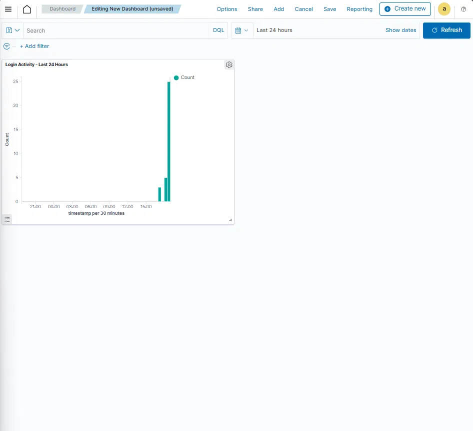

You're in the GitHub editor for README.md. Copy everything below and paste it into that editor:

# Wazuh SIEM Home Lab — Threat Detection & Log Monitoring

**Type:** Home Lab Project  
**Role Target:** SOC Analyst, Cybersecurity  
**Tools:** Wazuh 4.7, VMware Workstation Pro, Ubuntu Server 22.04, Windows 10, Sysmon (SwiftOnSecurity config)  
**Status:** Complete

---

## Project Overview

This project involved deploying a fully functional Security Information and Event Management (SIEM) system using Wazuh in a home lab environment. The goal was to simulate a real enterprise SOC setup — a centralized log server collecting and analyzing endpoint telemetry, with custom detection rules for common attack patterns.

SIEM platforms are a core tool for SOC analysts. The ability to deploy, configure, and write detection logic for a SIEM is one of the most sought-after skills in entry-level and mid-level cybersecurity roles. This project was built specifically to demonstrate that capability hands-on.

---

## Environment

| Component | Details |
|---|---|
| Hypervisor | VMware Workstation Pro 26H1 (free via Broadcom) |
| Wazuh Server | Ubuntu Server 22.04 VM — 4 vCPU, 8GB RAM, 100GB disk |
| Wazuh Version | 4.7.5 (all-in-one install) |
| Monitored Endpoint | Windows 10 PC (agent: windows-pc) |
| Endpoint Telemetry | Sysmon v15 with SwiftOnSecurity configuration |
| Network | VMware NAT — VM IP: 192.168.77.129 |

---

## What I Built

- Deployed Wazuh all-in-one (manager + indexer + dashboard) on a Ubuntu Server VM
- Enrolled a Windows 10 machine as a monitored agent
- Installed Sysmon on the Windows endpoint using the SwiftOnSecurity ruleset for enhanced telemetry
- Configured the Wazuh agent to collect Sysmon logs from the Windows Event Log channel
- Built a custom SOC dashboard with a login activity bar chart (last 24 hours)
- Wrote two custom detection rules targeting high-priority security events

---

## Custom Detection Rules

Custom rules are written in XML and stored at /var/ossec/etc/rules/local_rules.xml. Wazuh evaluates incoming log events against these rules in real time and generates alerts when conditions are matched.

### Rule 100002 — Multiple Failed Login Attempts

\```xml
<group name="local,authentication_failed,">
  <rule id="100002" level="10" frequency="5" timeframe="120">
    <if_matched_group>authentication_failed</if_matched_group>
    <description>Multiple failed login attempts detected</description>
    <group>authentication_failures,</group>
  </rule>
</group>
\```

**Why this matters:** Five or more failed logins within 120 seconds is a classic indicator of a brute force attack. This rule fires a Level 10 alert (high severity) when that threshold is crossed.

### Rule 100003 — New Admin Account Created

\```xml
<group name="local,windows,">
  <rule id="100003" level="12">
    <if_sid>60144</if_sid>
    <description>New admin account created on Windows</description>
    <group>account_management,</group>
  </rule>
</group>
\```

**Why this matters:** Unauthorized admin account creation is a common persistence technique used by attackers after gaining initial access. This rule fires a Level 12 (critical) alert mapping to MITRE ATT&CK privilege escalation techniques.

---

## Dashboard

A custom OpenSearch dashboard was built inside Wazuh to visualize login activity over time using the wazuh-alerts-* index, filtered by authentication events, displayed as a vertical bar chart over 24 hours.

---

## Challenges & How I Solved Them

**Ubuntu 24.04 Compatibility:** Wazuh 4.7 officially supports up to Ubuntu 22.04. The install script threw a compatibility error which was resolved by passing the --ignore-check flag.

**Rules UI Bug:** The Wazuh dashboard Rules page threw a JavaScript error due to the Ubuntu 24.04 compatibility gap. Custom rules were written directly in the terminal using nano — which is how rules are managed in many real enterprise deployments.

**curl vs wget:** Initial download of the install script using curl -sO printed to the terminal instead of saving to disk. Switching to wget resolved the issue.

---

## Results

- 1 active agent (Windows PC) reporting in real time
- 516+ alerts generated, automatically categorized by MITRE ATT&CK technique
- MITRE ATT&CK mappings including T1059, T1105, and T1087
- Custom detection rules active for brute force and admin account creation
- Login activity dashboard live in Wazuh SOC Dashboard

---

## Screenshots




---

## Resources

- Wazuh Documentation: https://documentation.wazuh.com
- Sysmon Config: https://github.com/SwiftOnSecurity/sysmon-config
- MITRE ATT&CK: https://attack.mitre.org
